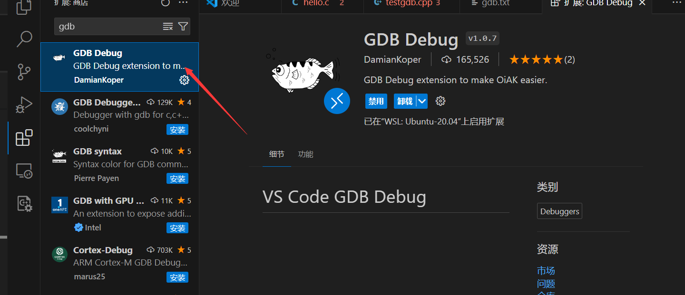
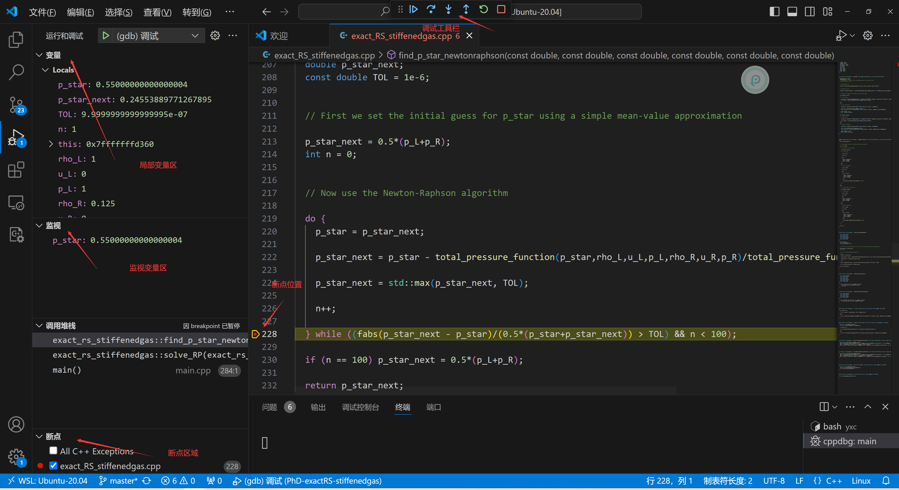

# C/C++ gdb调试

gcc/g++编译器是我们写编译C/C++程序时离不开的编译工具，而gdb又是调试C/C++程序的利器。gcc（GUN C Compiler）是GCC中的c编译器，而g++（GUN C++ Compiler）是GCC中的c++编译器。本文章将简单介绍gcc/g++的常用命令选项和gdb的调试命令。

## GCC/G++ 命令选项

GCC/G++的命令选项大致可以分为下面几类

- **编译选项**：控制编译过程的各个阶段，例如预处理、编译、汇编和链接。
- **优化选项**：控制编译器的优化级别，可以提高程序的运行效率。
- **调试选项**：生成调试信息，帮助程序员调试程序。
- **警告选项**：控制编译器警告信息的输出。
- **其他选项**：控制其他编译器行为，例如输出格式、目标平台等。

**编译的流程**


### 命令选项

| 选项      | 说明                                                         |
| --------- | ------------------------------------------------------------ |
| `-c`      | 汇编，对源文件而言是进行预处理、编译和汇编，并生成以`o`为后缀的目标文件(obj) |
| `-E`      | 只运行预处理，生成后缀为i的预编译文件                        |
| `-o`      | 生成指定的文件，缺省文件时是a.out。也可以进行链接，并生成可执行文件 |
| `-S`      | 进行预处理和编译后停止，生成.S后缀的文件                     |
| `-On`     | 优化代码，n是数字，可选0,1,2,3，默认是1，数字越大编译的时间越长，优化度越高 |
| `-I`      | 增加头文件路径。后面无空格的跟头文件的路径                   |
| `-D`      | 预定义宏 相当于在源代码中使用 #define name 或者是 #define name=val |
| `-l`      | 指定要连接的库（小写的英文L,不是数字1）后面紧跟库的文件名。虽然库名前有lib，但是链接的时候不需要加 |
| `-L`      | 配合上面的选项。指定所用到的库文件的路径                     |
| `-g`      | 生成调试信息以方便调试 后面也可以跟数字 默认`-g2`，此时产生的调试信息包括扩展的符号表、行号、局部或外部变量信息。`-g3`包含级别2中的所有调试信息，以及源代码中定义的宏 |
| `-ggdb`   | 使 GCC 只为 GDB 生成专用的更为丰富的调试信息.                |
| `-w`      | 不显示任何警告信息(不建议使用)                               |
| `-Wall`   | 显示所有的警告信息                                           |
| `-Werror` | 视警告为错误，出现警告即放弃编译                             |
| `-v`      | 显示编译器的版本信息和编译过程                               |
| `-std`    | 指定C/C++ 的版本，例如`-std=c99,-std=c++11`                  |


# gdb 调试

gdb 是一个支持多种语言的调试器，可以做下面四件事，

- 在程序开始时 设定参数
- 在指定的情况下 停止程序（比如设置断点）
- 在程序停止时 检查发生了什么 使用观察点
- 检查你的程序 修改bug

需要注意的是

- cpp文件的编译选项中 加入 -g，**不进行任何优化**`-O0` 并正常执行编译过程.

### gdb 命令参数

gdb中常用的命令参数有

| 参数          | 说明                                                         |
| ------------- | ------------------------------------------------------------ |
| `-q`          | 安静模式 不显示版权信息和警告信息                            |
| `-x file`     | 从文件中执行命令                                             |
| `-ex command` | 启动gdb后执行gdb命令，其中`command`是gdb的命令。 可以执行多条命令 |
| `-args args`  | 给运行时加入参数. 多个参数以空格分离                         |
| `-c core`     | 使用coredump 文件，`core`是文件名                            |

### 在gdb中启动程序

```
gdb 可执行文件名 参数1 ... 参数N
```

**运行程序**

在终端中输入 后面跟参数列表

```
run args
```

**或者** 简写为

```
r args
```


### 新增/删除断点

可以通过`break`来新增断点。断点可以是函数名 可以是源文件名和行号 甚至是地址

```
break main
```

通过`info b`查看所有的断点及其断点号 并通过`del` 来删除断点.如果不删除断点还可以使用`disable`以及`enable`来禁用删除断点。`del,diable,enable`后面都是跟的断点号。

 `break`后面还可以跟条件语句，进行有条件的停止

```
b filename:line if i ==2 
```


### 新增/删除观察断点

借助观察断点可以监控程序中某个变量或者表达式的值，只要发生改变，程序就会停止执行。

```
watch val/expr
```

`watch`后面跟的可以是变量，也可以是表达式

查看所有的观察点

```
info watchpoints
```

观察点的禁用，启用，删除同断点。

### 程序停止后的继续执行

在断点处停止后，继续往下执行的命令是

```
continue
```

或者简写为

```
c
```

如果只**执行到下一行**

```
next
```

简写为

```
n
```

### 设置修改变量值

可以通过`set`命令，修改当前的变量的值,例如

```
set i=1
```

也可以设定日志文件，

```
set logging on
```

会自动生成一个名字为 gdb.txt 的文件 会自动记录 你调试过程中的日志，显示使用了哪些命令。


## VSCODE 配置gdb

首先需要在插件市场中安装gdbdebug



然后打开一个工作区，配置`launch.josn`文件。我的配置文件是

```json
{
  "version": "0.2.0",
  "configurations": [
    {
      "name": "(gdb) 调试", //配置名称
      "type": "cppdbg", //配置类型
      "request": "launch", //请求配置类型，可以是启动或者是附加
      "program": "${workspaceFolder}/main", //程序可执行文件路径，${workspaceFolder}表示当前工作区的目录
      "args": [], //传递给程序的命令行参数
      "stopAtEntry": false, //可选参数，如果为true,调试程序应该在入口（main）处停止
      "cwd": "${workspaceFolder}", //当前工作区的目录
      "environment": [], //表示要预设的环境变量
      "externalConsole": false, //如果为true，则为调试对象启动控制台
      "MIMode": "gdb", //要连接到的控制台启动程序
      "setupCommands": [ //为了安装基础调试程序而执行的一个或多个GDB/LLDB命令
        {
          "description": "为 gdb 启用整齐打印",
          "text": "-enable-pretty-printing",
          "ignoreFailures": true
        }
      ]
    }
  ]
}
```

在最左侧工具栏中启动debug,可以看到下面的情况



可以使用图形化界面更加高效的调试程序。


## C++ 性能分析工具 gprof

gprof 是linux系统自带性能分析工具。它可以分析程序的性能，能给出函数调用时间、调用次数和调用关系，找出程序的瓶颈所在。


### 使用流程

1. 在**编译和链接**时加入选项`-pg`

此时编译器会自动在目标代码中插入用于性能测试的代码片断。这些代码在程序运行时会采集并记录函数的调用关系和调用次数，并记录函数自身执行时间和被调用函数的执行时间。

2. 运行程序后，自动生成gmon.out （二进制）文件
3. 使用gprof命令 来分析gmon.out 文件 例如

```
gprof main gmon.out
```

**注**：加`-pg`程序整体运行比不加要慢。

### gprof 命令参数

| 参数      | 说明                                 |
| --------- | ------------------------------------ |
| `-b`      | 不再输出统计图表中每个字段的详细描述 |
| `-p`      | 只输出函数的调用图                   |
| `-q`      | 只输出函数的时间消耗列表             |
| `-e func` | 不再输出函数func 及其子函数的调用图  |
| `-f func` | 只输出函数func 及其子函数的调用图    |

### 输出文件含义

输出文件表的末尾给出各个关键词的含义。

**以函数时间消耗列表为例**

| 关键词             | 解释                                |
| ------------------ | ----------------------------------- |
| time               | 每个函数调用所占的时间比例          |
| cumulative seconds | 累计时间，包含自身+子函数的调用时间 |
| self  seconds      | 只包含自身的时间                    |
| calls              | 调用次数                            |
| selfs/call         | 每次调用的自身时间                  |
| totals/call        | 每次调用的总时间                    |

**函数的调用关系表**


## 参考链接

```
https://andrewpqc.github.io/2018/11/25/gcc-and-gdb/
https://c.biancheng.net/view/8123.html
https://bashcommandnotfound.cn/article/linux-gcc-command
```


